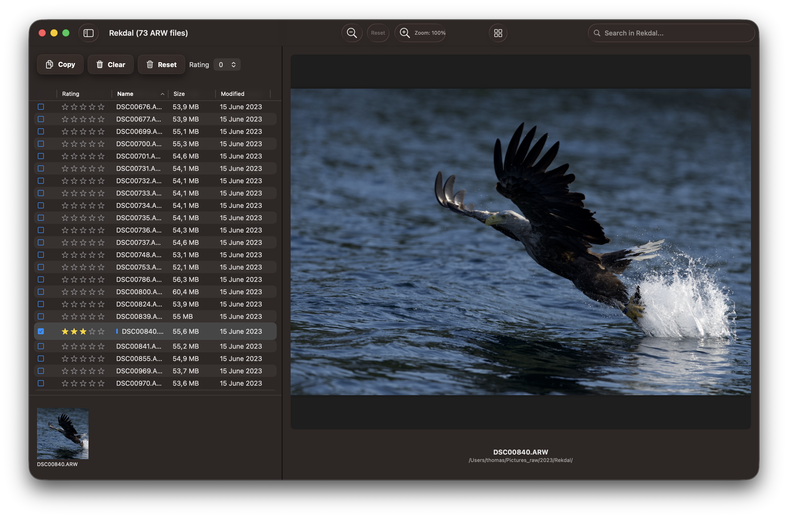

# RawCull

[](https://github.com/rsyncOSX/RawCull/blob/main/Licence.MD)

macOS photo review and selection application for Sony A1 mkI and mkII ARW raw files. This is a build for Apple Silicon only.

## Requirements

- macOS 26 Tahoe and later
- **Apple Silicon** (M-series) only

## Installation

RawCull is available for download on the [Apple App Store](https://apps.apple.com/no/app/rawcull/id6759362764?mt=12) or from the [GitHub Repository](https://github.com/rsyncOSX/RawCull/releases). It is possible that the GitHub version is released a day or two before the Apple App Store release due to the different release processes employed by each platform.

```
brew tap rsyncOSX/cask && brew install --cask rawcull
```

## ARW body compatibility diagnostic

All 76 files in test, parsed successfully across EXIF, focus points, sharpness, and saliency, with one exception: the ILCE-7RM5 produced a saliency failure on 1 of its 3 files. The ILCE-1M2 dominates the dataset at 55 files (72% of total), and is also the only body tested across all three Sony RAW size variants (S/M/L). All files use compressed RAW, and every body achieves full-resolution L-size output — ranging from 12.4 MP (ILCE-1M2 S-crop) up to 60.2 MP on the ILCE-7RM5.

The two next bodies to focus on are the ILCE-7M5 and ILCE-7RM5. However, I am dependent on test ARW files provided to me to test properly before I officially conclude support for these two bodies as well. I am aware of an issue with the ILCE-7M5 and compressed ARWs.

| Camera Body | Files | EXIF | FocusPt | Sharpness | Saliency | RAW Types | Dimensions |
|---|---|---|---|---|---|---|---|
| ILCE-1 | 4 | 4/4 | 4/4 | 4/4 | 4/4 | Compressed | 8640 × 5760 (49.8 MP, L) |
| ILCE-1M2 | 55 | 55/55 | 55/55 | 55/55 | 55/55 | Compressed | 4320 × 2880 (12.4 MP, S), 5616 × 3744 (21.0 MP, M), 8640 × 5760 (49.8 MP, L) |
| ILCE-7M5 | 8 | 8/8 | 8/8 | 8/8 | 8/8 | Compressed | 7008 × 4672 (32.7 MP, L) |
| ILCE-7RM5 | 3 | 3/3 | 3/3 | 3/3 | 2/3 | Compressed | 9504 × 6336 (60.2 MP, L) |
| ILCE-9M3 | 3 | 3/3 | 3/3 | 3/3 | 3/3 | Compressed | 6000 × 4000 (24.0 MP, L) |
| MODEL-NAME | 3 | 3/3 | 3/3 | 3/3 | 3/3 | Compressed | 7008 × 4672 (32.7 MP, L) |
| **Total** | **76** | **76/76** | **76/76** | **76/76** | **75/76** | | |

## Version

Current version: v1.4.0 - released April 7, 2026. Version 1.4.0 is submitted for approval for update on Apple App Store.

## Documentation

- [User documentation](https://rawcull.netlify.app)
- [Changelog](https://rawcull.netlify.app/blog/)




Focus Mask and Focus Point applied.


